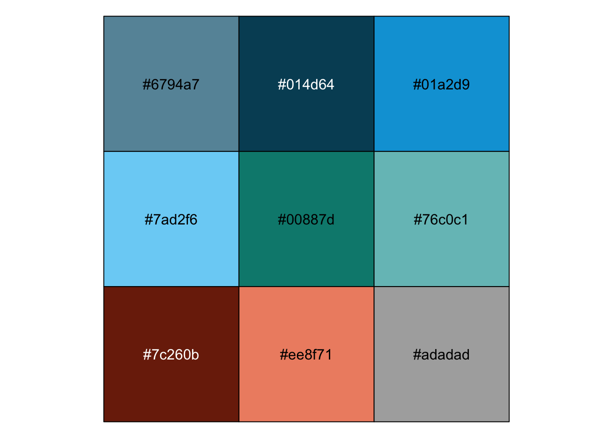
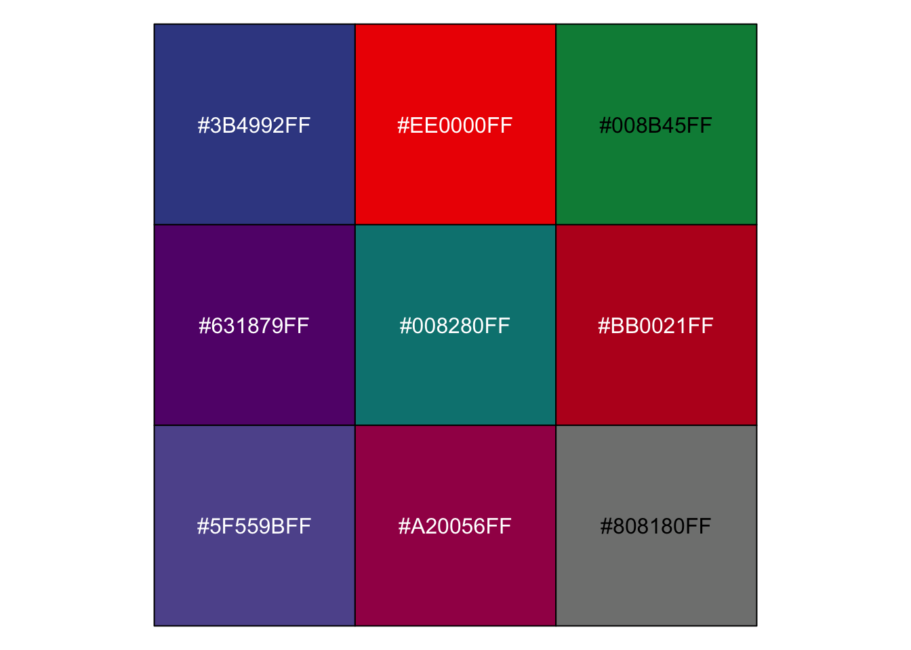

\mainmatter

# 数据可视化{#visu}

人都是视觉动物

## 从一个可以画恐龙的包说起

在闲逛R论坛的时候，偶然发现有人贴了一段如下的代码，这个代码可以画出一个恐龙。

```r
# install.packages("datasauRus")
library("datasauRus")
library(ggplot2)
ggplot(subset(datasaurus_dozen, dataset=='dino'), 
             aes(x, y)) + 
  geom_point()  
```


太神奇了吧，居然有人写了个包来画恐龙！但是仔细一想，这事儿可能没有那么简单。事出非常必有妖，谁会闲到辛辛苦苦发布一个R包就为了画个恐龙呢。

果然datasauRus是一个非常有名的数据包，他包括了若干组描述性统计完全一致，但是分布却截然不同的数据集，恰恰说明了可视化的必要性。

详情可见论文，*Same Stats, Different Graphs: Generating Datasets with Varied Appearance and Identical Statistics through Simulated Annealing**


```r
library(datasauRus)
library(dplyr)
```

```
## 
## Attaching package: 'dplyr'
```

```
## The following objects are masked from 'package:stats':
## 
##     filter, lag
```

```
## The following objects are masked from 'package:base':
## 
##     intersect, setdiff, setequal, union
```

```r
datasaurus_dozen %>% 
    dplyr::group_by(dataset) %>% 
    dplyr::summarise(
      mean_x    = mean(x),
      mean_y    = mean(y),
      std_dev_x = sd(x),
      std_dev_y = sd(y),
      corr_x_y  = cor(x, y))
```

```
## # A tibble: 13 × 6
##    dataset    mean_x mean_y std_dev_x std_dev_y corr_x_y
##    <chr>       <dbl>  <dbl>     <dbl>     <dbl>    <dbl>
##  1 away         54.3   47.8      16.8      26.9  -0.0641
##  2 bullseye     54.3   47.8      16.8      26.9  -0.0686
##  3 circle       54.3   47.8      16.8      26.9  -0.0683
##  4 dino         54.3   47.8      16.8      26.9  -0.0645
##  5 dots         54.3   47.8      16.8      26.9  -0.0603
##  6 h_lines      54.3   47.8      16.8      26.9  -0.0617
##  7 high_lines   54.3   47.8      16.8      26.9  -0.0685
##  8 slant_down   54.3   47.8      16.8      26.9  -0.0690
##  9 slant_up     54.3   47.8      16.8      26.9  -0.0686
## 10 star         54.3   47.8      16.8      26.9  -0.0630
## 11 v_lines      54.3   47.8      16.8      26.9  -0.0694
## 12 wide_lines   54.3   47.8      16.8      26.9  -0.0666
## 13 x_shape      54.3   47.8      16.8      26.9  -0.0656
```


## 调色板

选择优雅的颜色是高质量数据可视化的保障。如果不是艺术造诣很高的话，选择成熟的配色是最安全的选择。`ggthemes`包封装了多种成熟的主题，`ggsci`则包括了多种杂志的配色方案，我们可以使用`scales`包的show_col函数来查看色号。

例如，我们要查看并使用经济学人杂志的调色板，可以用下面的代码


```r
library(ggthemes)
library(scales)
library(ggsci)
show_col(economist_pal()(9))
```



```r
economist_pal()(9)
```

```
## [1] "#6794a7" "#014d64" "#01a2d9" "#7ad2f6" "#00887d" "#76c0c1" "#7c260b"
## [8] "#ee8f71" "#adadad"
```

如果要使用science杂志的配色，可以用下面的代码。

```r
show_col(pal_aaas()(9))
```



```r
pal_aaas()(9)
```

```
## [1] "#3B4992FF" "#EE0000FF" "#008B45FF" "#631879FF" "#008280FF" "#BB0021FF"
## [7] "#5F559BFF" "#A20056FF" "#808180FF"
```

当然，艺术造诣和编程能力并不是互斥的技能点。例如，R语言社区资深开发者（`ggplot2`包的作者）、计算认知科学家Danielle Navarro就是一名计算艺术家（computational artist）。下面是她的作品*Dancer*，更多作品可以浏览https://art.djnavarro.net/。
