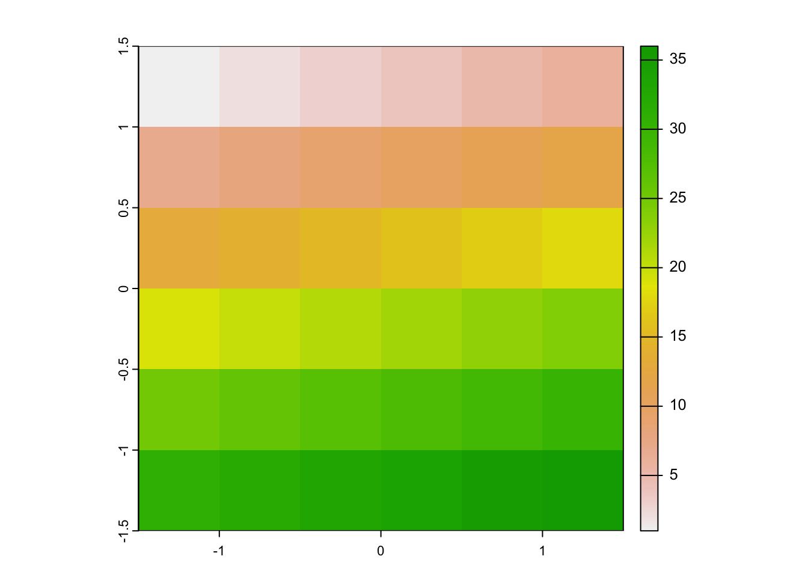
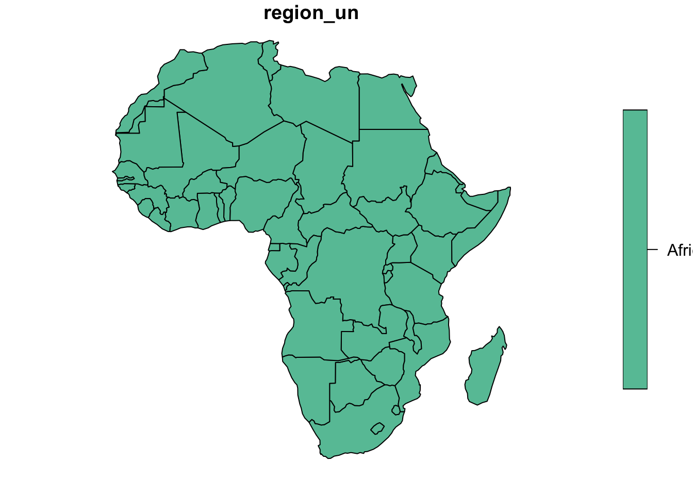

\#\mainmatter

# 地理计算 {#geo}

> 就是为了这点儿醋，我才包的这顿饺子。 *---邪不压正*

地理计算（geocomputation）指的是将编程语言应用于地理数据以解决地理与空间问题的过程。地理计算是地理学与计算科学的交叉领域，其核心一方面是以何种数据结构刻画具有空间属性的信息，这建立在地理信息系统（Geographic Information Systems，GIS）的基础上；另一方面是以何种方式对地理数据进行操纵、可视化与统计计算。本章的重点则是通过R语言处理地理数据来满足经济学分析的需要。

## R中地理计算

2000之前，R语言社区便开发出了用于地理计算的包，例如`spatial, sgeostat,splancs`。2005年，`sp`包第一次开发出特定的空间数据结构，可以用于储存点、边、多边形和网格等空间数据。`sp`极大推动了R地理计算的发展，当前有600多个包依赖于`sp`，`sp`已经是R语言生态中必不可少的组成部分。`sp`的不足在于其对"栅格数据(raster)"的支持比较有限，这恰好被2010年开发的`raster`包补齐，其继承者`terra`则实现了对raster数据更高效和简洁的处理。

地理计算的另一个主要在R中制作各式样的地图，`ggmap,tmap, leaflet和mapview`主要是针对这一用途。

本章的主要内容是参考Robin Lovelace, Jakub Nowosad, Jannes Muenchow的著作*Geocomputation with R*[<https://geocompr.robinlovelace.net/index.html>]，我们认为这是目前用于地理计算的最佳工具。本章使用的主要包是`sf`与`terra`，数据则在`spData`与`spDataLarge`包中。


```r
library(sf)          
library(terra)      
library(spData)        
library(spDataLarge)  
```

```
## Warning: package 'spDataLarge' was built under R version 4.2.3
```

## 地理数据结构

在正式介绍地理数据结构之前，我们先仔细观察一下下面的地图。


可以发现，这幅非洲地图是由一块块如下图的图形组合而成的。


由于任何复杂的曲线在局部都可以近似表示为一段折线，因此上图中的图形可以近似看做一个多边形，组成这个多边形的基本要素包括点与线段，这便构成了地理数据基本数据结构--向量。

除此之外，栅格数据是另一类基本地理数据结构，以矩阵的方式刻画一个背景图片信息。

### 向量（Vector）

地理向量是sf包中刻画地理信息的数据结构，也是经济学中使用最多的地理数据结构。值得注意的是，地理向量并非R中的向量类。sf中的地理向量是包含了几何列（geometry columns）的数据框。

#### 简单要素

sf中使用openGIS的简单要素（simple features）来刻画地理数据，最常用的7类简单要素如下为：

| 要素                        | 生成函数                    | 解释                                                                                      |
|-----------------------------|-----------------------------|-------------------------------------------------------------------------------------------|
| 点Point                     | st_point(vector)            | 二维或者三维的坐标点，例如(5 2)                                                           |
| 线段Linestring              | st_linestring(matrix)       | 一列点按照顺序连接形成的线段，例如(1 5, 4 4, 4 1, 2 2, 3 2)                               |
| 多边形Polygon               | st_polygon(list)            | 多点相连形成的闭合图形，例如((1 5, 2 2, 4 1, 4 4, 1 5))                                   |
| 点组合Multipoint            | st_multipoint(matrix)       | 多个坐标点的组合，例如(5 2, 4 4)                                                          |
| 线段组合Multilinestring     | st_multilinestring(list)    | 多个线段的组合，例如((1 5, 4 4, 4 1, 2 2, 3 2), (1 2, 2 4))                               |
| 多边形组合Multipolygon      | st_multipolygon(list)       | 多个多边形的组合，例如(((1 5, 2 2, 4 1, 4 4, 1 5), (0 2, 1 2, 1 3, 0 3, 0 2)))            |
| 图形组合Geometry collection | st_geometrycollection(list) | 各类简单要素的组合，例如多点与线段的组合((5 2, 1 3, 3 4, 3 2), (1 5, 4 4, 4 1, 2 2, 3 2)) |

#### 简单要素几何（**Simple feature geometries, sfg）**

st_为前缀的函数可以将一般数据结构转化为地理数据，即成为简单要素几何。例如，st_point可以将向量转化成为地理点，st_linestring可以将矩阵转化为线段，st_polygon可以将以矩阵为元素的列表转化为多边形。


```r
pt <- st_point(c(5,2))
lnstr <- st_linestring(rbind(c(1, 5), c(4, 4), c(4, 1), c(2, 2), c(3, 2)))
plg <- st_polygon(list(rbind(c(1, 5), c(2, 2), c(4, 1), c(4, 4), c(1, 5))))
```

使用`plot`函数可以将sfg可视化，例如：


```r
plot(plg)
```


#### 简单要素列（**Simple feature columns, sfc）**

`st_sfc` 函数可以将多个sfg合并成为以sfg为元素的列向量：


```r
plg1 <- st_polygon(list(rbind(c(1, 5), c(2, 2), c(4, 1), c(4, 4), c(1, 5))))
plg2 <- st_polygon(list(rbind(c(0, 2), c(1, 2), c(1, 3), c(0, 3), c(0, 2))))
polygon_sfc = st_sfc(plg1, plg2)
st_geometry_type(polygon_sfc)
```

```
## [1] POLYGON POLYGON
## 18 Levels: GEOMETRY POINT LINESTRING POLYGON MULTIPOINT ... TRIANGLE
```

```r
plot(polygon_sfc)
```


上面代码中，st_geometry_type用于判断地理数据的类型，plot将多边形组合可视化。

#### sf类

正如前文所述，地理向量是包括几何列（即sfc）的数据框，地理向量的其他列用于刻画地理数据的属性，使用st_sf函数可以将几何列与属性列合并成为最终的地理向量，即sf类。


```r
sh_point = st_point(c(121.47, 31.23))      
sh_geom = st_sfc(sh_point, crs = 4326)    
sh_attrib = data.frame(            
  name = "Shanghai",
  temperature = 19,
  date = as.Date("2021-11-29")
  )
sh_sf = st_sf(sh_attrib, geometry = sh_geom) 
class(sh_sf)
```

```
## [1] "sf"         "data.frame"
```

生成的sf类在R中以数据框的形式储存如下：

 注意，**sfc只能有一列几何列，为了方便，通常命名为geometry或者geom。**

### 栅格（Raster）

栅格数据以像素的方式储存一个或多个图层，**terra**包中的`raster` 函数用于生成栅格数据。


```r
new_raster = rast(nrows = 6, ncols = 6, resolution = 0.5, 
                  xmin = -1.5, xmax = 1.5, ymin = -1.5, 
                  ymax= 1.5,vals = 1:36)
plot(new_raster)
```



### 坐标系（coordinate reference system）

上述方法中生成的地理数据仍是欧几里得空间中的二维数据，为了描述与地球对应的地理属性，我们需要引入刻画地球的坐标系。地理信息系统中有两种坐标系：地理坐标系（Geographic coordinate system）与投影坐标系（Projected coordinate systems），前者是针对地球的建立的三维模型，包括球形坐标系与椭球坐标系，后者则是将地球投影在二维空间的坐标系，根据投影方式不同又有多种分类。

欧洲调查组织（European Petroleum Survey Group，EPSG）专门负责维护地球的上的所有测量坐标系统，并且给每组坐标系统都赋予了一个编号和一组描述。目前通用的地理坐标系为WGS84，其编号是EPSG:4326；互联网地图常用的伪墨卡托投影坐标系，编号就是EPSG:3857。

`st_sfc`函数的crs参数可以在定义sfc时指定坐标系，`st_crs` 可以查看地理数据的坐标系，`st_set_crs`可用于修改地理数据的坐标系，例如：


```r
sh_sf <- st_set_crs(sh_sf, "EPSG:4326")
st_crs(sh_sf)
```

```
## Coordinate Reference System:
##   User input: EPSG:4326 
##   wkt:
## GEOGCRS["WGS 84",
##     ENSEMBLE["World Geodetic System 1984 ensemble",
##         MEMBER["World Geodetic System 1984 (Transit)"],
##         MEMBER["World Geodetic System 1984 (G730)"],
##         MEMBER["World Geodetic System 1984 (G873)"],
##         MEMBER["World Geodetic System 1984 (G1150)"],
##         MEMBER["World Geodetic System 1984 (G1674)"],
##         MEMBER["World Geodetic System 1984 (G1762)"],
##         MEMBER["World Geodetic System 1984 (G2139)"],
##         ELLIPSOID["WGS 84",6378137,298.257223563,
##             LENGTHUNIT["metre",1]],
##         ENSEMBLEACCURACY[2.0]],
##     PRIMEM["Greenwich",0,
##         ANGLEUNIT["degree",0.0174532925199433]],
##     CS[ellipsoidal,2],
##         AXIS["geodetic latitude (Lat)",north,
##             ORDER[1],
##             ANGLEUNIT["degree",0.0174532925199433]],
##         AXIS["geodetic longitude (Lon)",east,
##             ORDER[2],
##             ANGLEUNIT["degree",0.0174532925199433]],
##     USAGE[
##         SCOPE["Horizontal component of 3D system."],
##         AREA["World."],
##         BBOX[-90,-180,90,180]],
##     ID["EPSG",4326]]
```

sfc只能有一列几何列，为了方便，通常命名为geometry或者geom。

如何将多个地理数据框存放在一起呢？

## 地理数据操纵

我们假设本书的读者的学习目标是利用R处理地理数据以服务于经济学或者其他社会科学的研究，而不是成为一名地理信息系统的专家。因此，在介绍地理数据的操纵之前，我们先设想一下在经济学研究中对地理数据有哪些需求？

首先是数据可视化，很多时候我们希望画一个酷炫的地图，甚至是一个酷炫的动画地图，这是最常见也是最容易满足的需求；

其次，我们有时候需要通过地理数据计算一些经济变量，最简单的是两点之间的距离，论文*Patent Citations as a Measure of Knowledge Flows: The Influence of Examiner Citations*使用的一个因变量是两个专利之间的地理距离；更复杂一些的情况下，我们会需要计算点与其他地理对象之间的距离，例如，在我的工作论文*Minimum Wages and Business Location in China: Estimates Based on a Refined Border Approach*，需要计算一家企业距离行政区划边界之间的距离；

第三，对地理数据的修改，例如合并，简化，从而生成一个新的地理对象，例如我们在做一些分析的时候可能需要把欧盟国家合并成为整个区域来进行处理，或者我们需要把不同的铁路段连接成为一整个铁路网络，进而计算一个城市距离最近铁路线路的距离。

以上三个需求分别对应：地理数据可视化、地理计算以及地理数据操纵。在熟悉地理数据结构的基础上，我们可以分别介绍上述三个功能如何实现。

## 地理数据可视化

动态地图

## 地理数据运算

### 取子集

地理数据可以通过属性列或者地理列的空间关系实现取子集运算。前者与普通的数据框相同，例如下面的代码可以取出来世界地图的非洲区域：


```r
data <- world["region_un"]
Africa <- data[data$region_un == "Africa",]
plot(Africa)
```



后者需要依赖于`sf`包提供的空间关系函数，并通过[]运算符st_filter来取子集，例如下列代码可以取出与非洲大陆距离在100km范围内，且不接壤的所有国家或地区：


```r
library(dplyr)
```

```
## 
## Attaching package: 'dplyr'
```

```
## The following objects are masked from 'package:terra':
## 
##     intersect, union
```

```
## The following objects are masked from 'package:stats':
## 
##     filter, lag
```

```
## The following objects are masked from 'package:base':
## 
##     intersect, setdiff, setequal, union
```

```r
data <- world["region_un"]
Africa <- data[data$region_un == "Africa",]
Africa <- Africa %>% 
    group_by(region_un) %>% 
    summarise()
data2 <- world["iso_a2"]
country_wt <- st_is_within_distance(data2,Africa,dist=1000000,sparse=FALSE)
country_af <- st_intersects(data2,Africa,sparse=FALSE)
neighbor <- country_wt&(!country_af)
plot(data2[neighbor,])
```


其他常见二元地理关系函数，以两个地理对象为输入，返回值为1或0。

| 函数                  | 返回1的条件                                                                                            |
|-----------------------|--------------------------------------------------------------------------------------------------------|
| st_contains           | 第一个对象完全包含第二个对象，且B至少有一个点存在于A内部。                                             |
| st_contains_properly  | 第一个对象完全包含第二个对象内部。st_contains(A, A) = TRUE, 但是 st_contains_properly(A, A) = FALSE 。 |
| st_covered_by         | 第二个对象完全包含第一个对象                                                                           |
| st_covers             | 第一个对象（含边界）完全包含第二个对象                                                                 |
| st_crosses            | 两个对象的内部交集非空，且交集不等于任何一个输入对象的内部                                             |
| st_disjoint           | 两个对象的内部交集为空集                                                                               |
| st_equals             | 两个对象相同                                                                                           |
| st_intersects         | 两个对象的交集非空                                                                                     |
| st_is_within_distance | 两个对象的距离在小于等于参数                                                                           |
| st_within             | st_within(A,B) = st_contains(B,A)                                                                      |
| st_touches            | 两个对象交集非空，但内部交集为空                                                                       |
| st_overlaps           | 两个对象的交集非空，交集与输入对象相同维度，且不等于任何一个输入对象                                   |

raster就当成矩阵来做处理即可 global(grain, sd)函数做summary

## 地理数据读写

常见地理数据文件包括：ESRI Shapefile(.shp)、GeoJSON(.geojson)、KML(.kml)、ESRI FileGDB (.gdb)、Arc ASCII(.asc)、GeoPackage(.gpkg)等。`sf`包提供`read_sf`与`rast`函数来读入地理数据。

以GeoJSON为例，保定高新区-东区的四至范围储存在以下的文件当中:


下面代码使用read_sf读入上述文件。


```r
dv_zone <- read_sf(dsn = "保定高新区-东区.txt")
class(dv_zone)
```

```
## [1] "sf"         "tbl_df"     "tbl"        "data.frame"
```

```r
plot(dv_zone)
```


可以看到读入的对象直接是一个sf类。

`sf`包提供`write_sf`与`writeRaster`函数写出地理数据，下面代码可以将`dv_zone`输出为gpkg文件。


```r
st_write(obj = dv_zone, dsn = "保定高新区-东区.gpkg",
         delete_dsn = T)
```

```
## Deleting source `保定高新区-东区.gpkg' using driver `GPKG'
## Writing layer `保定高新区-东区' to data source 
##   `保定高新区-东区.gpkg' using driver `GPKG'
## Writing 1 features with 0 fields and geometry type Polygon.
```

FROM_GeoJson 用于读入geoJson数据

```         
file_js = FROM_GeoJson(url_file_string = name)
plg <- st_polygon(list(file_js[["features"]][[k]][["geometry"]]$coordinates))
polygon_sfc = st_sfc(plg,crs = 4326)
block = data.frame(name = name)
block_sf <- st_sf(block, geometry = polygon_sfc)
dvlp_zone <- rbind(dvlp_zone,block_sf)
```

## 地理数据计算

`st_distance`函数可直接的用于两个地理向量之间的距离。当地理向量采用地球坐标系时，`st_distance`函数会直接返回地球地球面距离。
